# Employee Management System

## 🌟 Overview

This project is a desktop application developed using Java Swing for managing employee information, including departments, designations, and user accounts. It provides a user-friendly interface for HR-related tasks.

---

## ✨ Key Features

*   Manage Employee Records: Add, update, and delete employee information.
*   Department Management: Create and manage departments within the organization.
*   Designation Management: Define and manage job designations.
*   User Authentication: Secure login for different user roles (Admin, HR Manager, HR Assistant).
*   Data Persistence: Store and retrieve employee data from files.

---

## 🛠️ Technology Stack

*   **Frontend:** Java Swing
*   **Backend:** Java
*   **Database:** File-based data storage (txt files)
*   **Development Tools:** NetBeans

---

## 🚀 Getting Started

### Prerequisites

*   Java Development Kit (JDK)
*   NetBeans IDE (Optional)

### Installation & Setup

1.  Clone the repository:
    ```bash
    git clone https://github.com/ama-23-ops/EmployeeManagementSystem-UniversityProject.git
    ```
2.  Navigate to the project directory:
    ```bash
    cd EmployeeManagementSystem-UniversityProject
    ```
3.  Open the project in NetBeans IDE.
4.  Build the project to compile the Java source files.

### Running the Application

*   Run the `EmployeeManagementSystem.java` file to start the application.

---

## 💡 Project Structure

```
project-root/
├── src/                    # Source code
│   ├── employeemanagementsystem/
│   │   ├── adminFrame.java       # Admin frame
│   │   ├── hrAssistantFrame.java # HR Assistant frame
│   │   ├── HrManagerMainForm.java# HR Manager frame
│   │   ├── LoginFrameForm.java   # Login frame
│   │   ├── Department.java       # Department class
│   │   ├── Designation.java      # Designation class
│   │   ├── Employee.java         # Employee class
│   │   ├── EmployeeManagementSystem.java # Main class
│   │   └── fileManagementLogics.java # File management logic
├── build.xml               # NetBeans build file
├── employee_data.txt       # Employee data file
├── department_data.txt     # Department data file
├── designation_data.txt    # Designation data file
├── user_data.txt           # User data file
└── README.md
```

---

## 🎯 Learning & Challenges

This project provided experience in developing desktop applications using Java Swing, managing data persistence with files, and implementing user authentication. Challenges included designing a user-friendly interface and ensuring data integrity.

---

## 📸 Screenshots

| Feature/Screen                      | Screenshot                                                                  |
| ----------------------------------- | --------------------------------------------------------------------------- |
| Common Login Page                   | 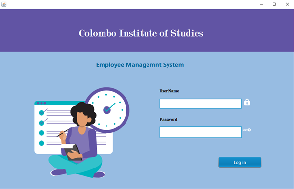                            |
| Admin Dashboard                     | 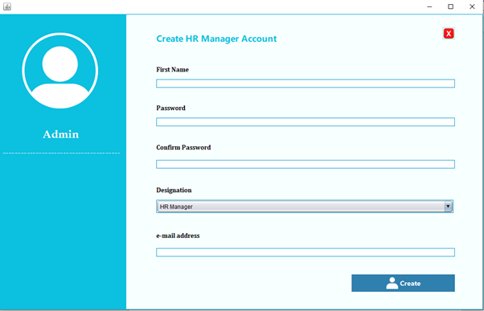                              |
| HR Manager Department Management    | 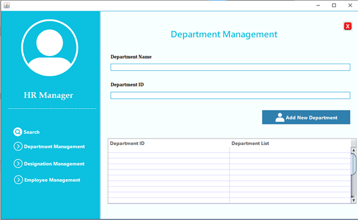             |
| HR Manager Department Management    | 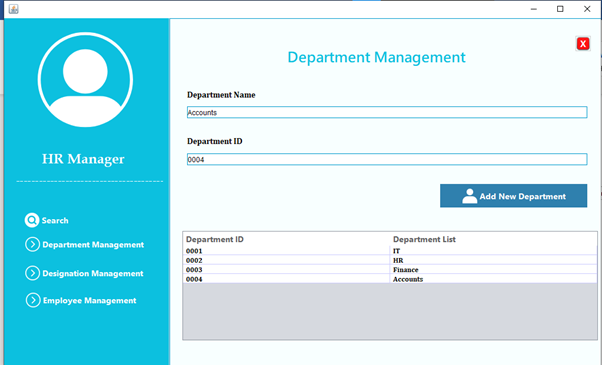             |
| HR Manager Designation Management   | 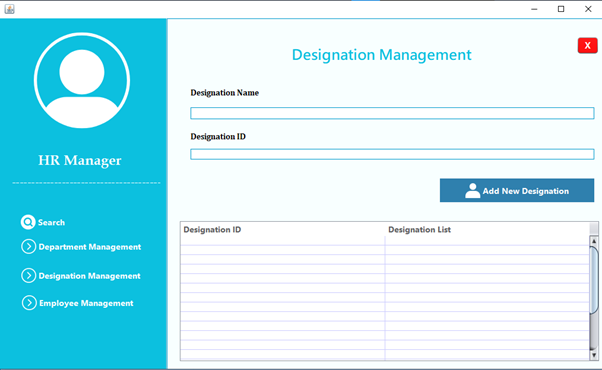            |
| HR Manager Designation Management   | 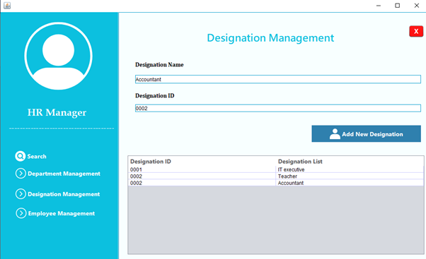            |
| HR Manager Employee Management      | 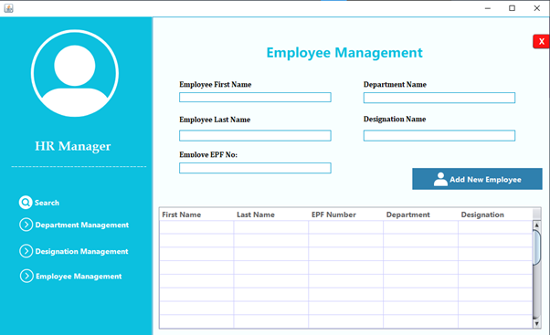               |
| HR Manager Employee Management      | 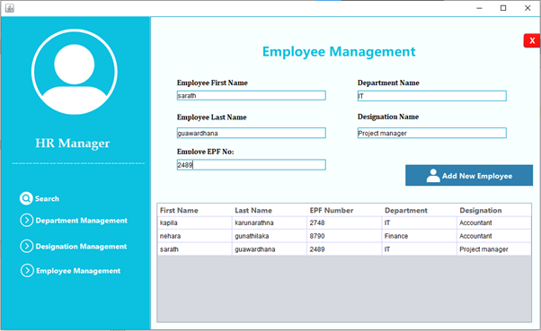               |
| Search Page                         | 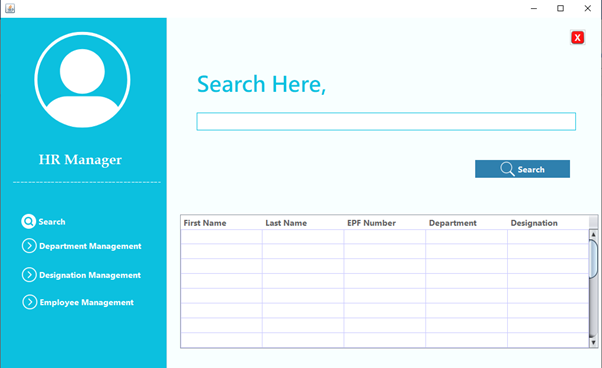                                  |
| Search page                         | 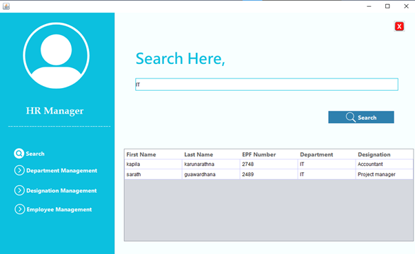                                 |
| HR Assistant Employee Management    | 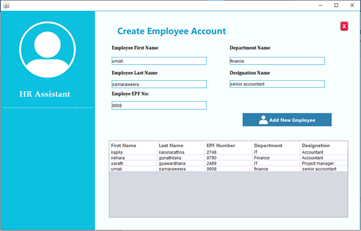            |

---


## 📜 License

This project is licensed under the MIT License - see the [LICENSE.md](LICENSE.md) file for details.

---

